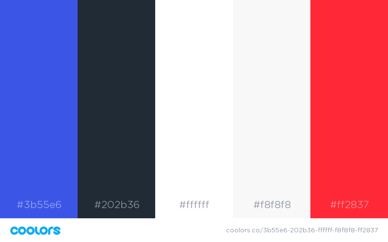

# Design

Instead of going for a write first, test second approach, it was determined that creating a prototype instead of live coding would be more efficient on the long run,
as changes can be easily made to a design 

## Shared Pages
Some of the pages on the app are shared accross all users, as they don't contain information that is tied to a user's account. 
However, these pages could display information to the user in the form of alert or popups.

### Landing Page

As the overall idea for the project is to connect the customer to the tracking of their shipments.
Because of that, one of the main areas for the landing page is the tracking button.

### User Login

## User-dependent pages

### Customer

#### Dashboard

#### Tracking

### Admin/Staff

#### Landing Page

#### User Login

#### Dashboard

#### Tracking

#### Analytics

## Miscelaneous

### Color Palette

* 
Royal Blue: #3B55E6
 
* 
Charleston Green: #202B36

* 
Ghost White: #F8F8F8

* 
Red (Pantone): #FF2837
